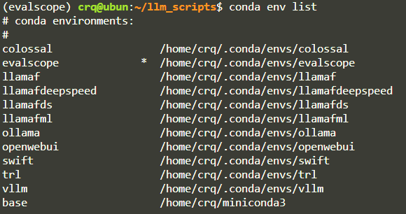
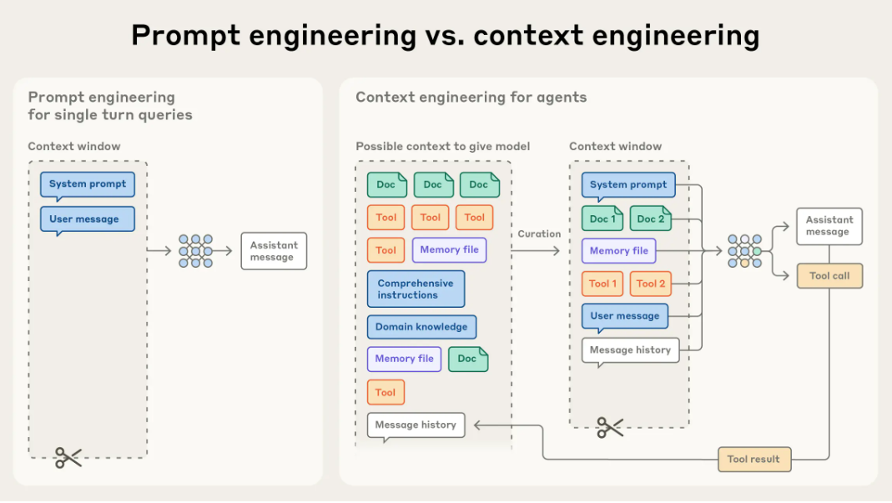

# LLM Notes

在较为有限的条件（NVIDIA GeForce RTX 3060 × 2，CUDA Version: 12.8）下实现单机多卡下的部署、推理、微调、评估、个性化项目的实现等。

unsloth、Llama-Factory等可以使用docker拉取到本地，但是选择使用pypi等自己构建基本环境，熟悉具体流程、解决构建环境时发生的各种依赖矛盾等问题。

使用**modelsscope**、**hugging face**。

对于使用Qwen、Llama等大模型进行LoRA或GRPO等参数高效微调，可直接选用Unsloth、Llama-Factory、Swift等高层框架。若涉及更复杂的模型结构修改或定制化训练需求，则需依赖TRL、PEFT、Transformers等底层库进行深度开发。

## 环境设置

## 推理

## 评估

### evalscope

## 部署

### vllm 

[`vllm/start_vllm_server.md`](vllm/start_vllm_server.md)

### open-webui

# 微调

### unsloth

### Llama Factory

### Swift

### Colossal-AI

### TRL

# AI Agent

fastAPI

AutoGen

HelloAgents

Qdrant 

### RAG 与 记忆系统 (Memory) 对比表

| 维度 | RAG (检索增强生成) | 记忆系统 (Memory) |
| :--- | :--- | :--- |
| **数据来源** | **外部、静态**的知识库（如法律条文、百科、公司规章）。 | **内部、动态**的经历（如对话历史、用户喜好、任务结果）。 |
| **读写属性** | **只读**（通常是提前向量化好的知识）。 | **可读可写**（随着对话进行不断产生并更新记忆）。 |
| **目的** | 解决“知识匮乏”和“推理幻觉”问题。 | 解决“上下文连贯”和“个性化体验”问题。 |
| **更新频率** | **低**（仅在外部知识库变更时更新索引）。 | **极高**（每一轮对话都会实时写入和更新）。 |
| **比喻** | 像 Agent 翻阅的**“参考资料/教科书”**。 | 像 Agent 随身记录的**“日记本/备忘录”**。 |

### 提示工程与上下文工程

## 法学领域中 4 个典型的工具链应用场景：

在法学领域，工具链（Tool Chain）的应用极具价值，因为法律工作通常具有**严谨的逻辑先后顺序**且**容错率极低**。通过工具链，我们可以将原本依赖人工反复核对的“体力活”自动化，并利用 LLM 处理非结构化文本的能力。

---

### 1. 案例检索与判例分析链（Research & Analysis）

在准备诉讼时，律师需要寻找“类案”。传统的检索只能靠关键词，而工具链可以实现全自动的判例画像。

* **步骤 1（事实提取）：** 输入本案起诉状，利用 LLM 提取关键法律事实（案由、争议焦点、标的额）。
* **步骤 2（自动化检索）：** 将提取的关键词自动传入法律数据库 API（如北大法宝），检索近 3 年的相似判例。
* **步骤 3（判决预测）：** 将检索到的 10 份判例全文喂给 LLM，对比裁判尺度，计算胜诉率百分比。
* **步骤 4（简报生成）：** 自动生成一份《类案检索报告》，供律师参考。

### 2. 自动化合规审核链（Compliance Review）

企业法务每天要处理大量合同，工具链可以作为“第一道防线”。

* **步骤 1（文档切片）：** 将长达百页的合同拆解为条款片段。
* **步骤 2（风险识别）：** 调用“合规检查工具”，根据企业预设的底层库（如：禁止预付款超过 30%），逐条对比合同内容。
* **步骤 3（条款修正）：** 发现违规项后，自动调用 LLM 基于企业模板生成“建议修改口径”。
* **步骤 4（汇总报告）：** 输出一份红线对比表，高亮显示高风险条款。

### 3. 证据链条穿透分析（Evidence Tracing）

在复杂的经济犯罪或民事纠纷中，证据往往支离破碎。

* **步骤 1（OCR 解析）：** 自动扫描银行流水、微信截图、合同照片，转化为结构化数据。
* **步骤 2（实体关联）：** 利用元数据（Metadata）标记每份证据的时间、地点、人物。
* **步骤 3（逻辑冲突检测）：** 工具链比对不同证据的矛盾点（例如：被告称 A 时间在上海，但其消费记录显示在广州）。
* **步骤 4（可视化）：** 自动生成证据关联图谱或时间轴。

### 4. 法律文书自动生成链（Document Generation）

从单纯的“填空”进化为“逻辑生成”。

* **步骤 1（访谈机器人）：** 通过对话收集合同双方信息（类似问卷）。
* **步骤 2（逻辑选型）：** 工具链根据收集的信息判断适用哪种模板（例如：根据金额判断是否需要加入担保条款）。
* **步骤 3（文书合成）：** 自动填充占位符，生成 Word 文档。
* **步骤 4（签章流转）：** 直接触发电子签章系统（如上文提到的 Zapier 联动）发送给客户。

---

### 💡 为什么法律场景必须用“工具链”而不是“单模型”？

1. **解决幻觉问题**：法律不容错答。工具链通过**“检索 + 校验”**，确保法律法规的引用来源于权威数据库，而非 AI 的“背诵”。
2. **可解释性**：法律需要溯源。工具链每一步的中间产物（如检索到的原文）都可以作为元数据保留，方便律师复核。
3. **权限隔离**：通过元数据标记，确保不同部门的法务只能调用属于自己权限范围内的合同模板或案例库。

**您是想针对某个具体的法律场景（如婚姻法、公司合规）设计一个原型，还是想深入了解如何将外部法律数据库接入到我们之前的工具管理器中？**