## evalscope的安装

```bash
conda activate evalscope

# 安装vllm：
pip install bitsandbytes>=0.45.3 # 动态量化需要
pip install --upgrade vllm

# 安装jupyter
conda install jupyterlab
conda install ipykernel

python -m ipykernel install --user --name evalscope_env --display-name "Python (evalscope)"

# 安装evalscope：
pip install evalscope # 安装 Native backend (默认)
# 额外选项
pip install 'evalscope[opencompass]' # 安装 OpenCompass backend
pip install 'evalscope[vlmeval]' # 安装 VLMEvalKit backend
pip install 'evalscope[rag]' # 安装 RAGEval backend
pip install 'evalscope[perf]' # 安装 模型压测模块 依赖
pip install 'evalscope[app]' # 安装 可视化 相关依赖
# 或可以直接输入all，安装全部模块
pip install 'evalscope[all]' # 安装所有 backends (Native, OpenCompass, VLMEvalKit, RAGEval)
```

### [evalscope支持断点重跑](https://github.com/modelscope/evalscope/issues/567)

使用use_cache参数定传入上次评测输出的路径

### modelscope官网的Qwen3模型全面评测

[链接](https://evalscope.readthedocs.io/zh-cn/latest/best_practice/qwen3.html)

除了在本地使用vLLM、ollama等框架直接启动模型，还可以通过OpenAI API兼容的推理服务接入模型能力，以进行评测。

#### 压力测试：
```bash
evalscope perf \
    --model /home/crq/.cache/modelscope/hub/models/Qwen/Qwen3-0.6B-Base \
    --url "http://localhost:8000/v1/chat/completions" \
    --parallel 5 \
    --number 20 \
    --api openai \
    --dataset openqa \
    --stream
```


| 参数 | 中文含义说明 |
| :--- | :--- |
| `--model` | **模型唯一标识**：必须与 vLLM 启动时的模型名称对应。 |
| `--url` | **服务地址**：指向本地 vLLM 监听的端口和路径。 |
| `--parallel` | **并发数**：模拟同时有 5 个用户向模型发起请求。 |
| `--number` | **总请求数**：本次测试一共会发送 20 条压力测试数据。 |
| `--api` | **接口协议**：vLLM 兼容 OpenAI，故选择此协议。 |
| `--dataset` | **测试数据集**：使用内置的开放问答数据集作为输入源。 |
| `--stream` | **流式模式**：开启后会统计 TTFT（首字返回延迟）。 |

[api-key获取方式](https://modelscope.cn/my/myaccesstoken)

压力测试过程与结果截图:
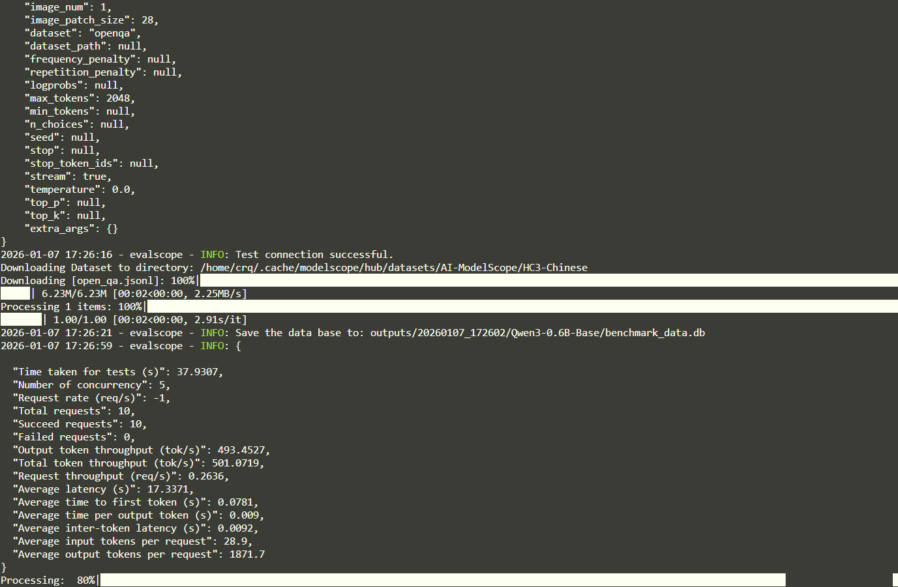
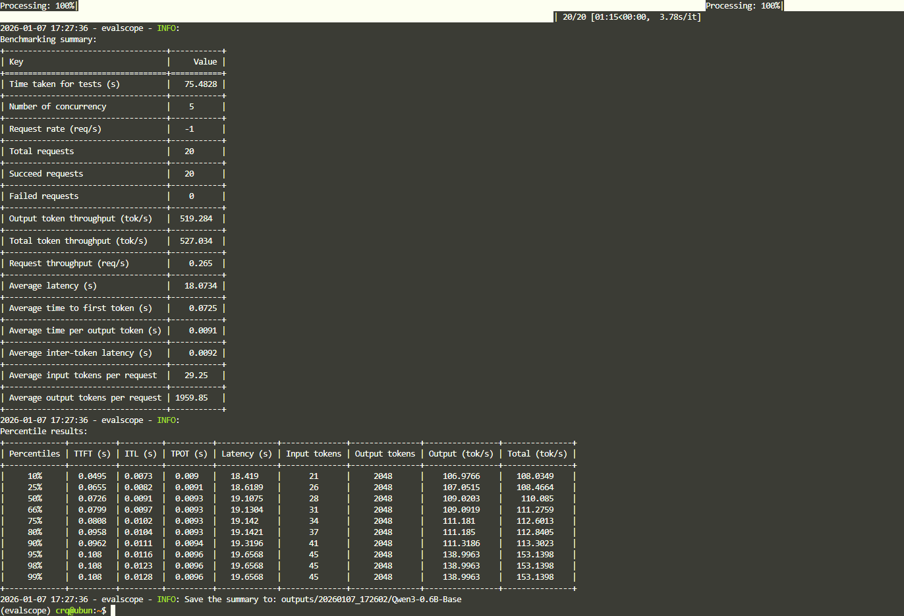


### 模型能力评测

#### 构建评测集合(可选可不选)

见 `./construct_eval_datasets.py`, 执行后数据集都被下载到`/home/crq/.cache/modelscope/hub/datasets`

#### 开始测评
见 `./evalscope_qwen3_4b-base.py`

测评gsm8k(中小学数学题), 100题

`few_shot_num = 4`:

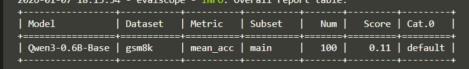

`few_shot_num = 10`:

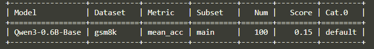

0.6B小模型，few_shot_num增加后，正确率提高。

#### 对于`Qwen3-4B`
· 评测：
- gsm8k, `few_shot_num = 4`：中小学数学
- hellaswag, `few_shot_num = 0`, 英文，常识
- ceval, `few_shot_num = 5` 基础中文

通过命令`evalscope app`进入可视化界面

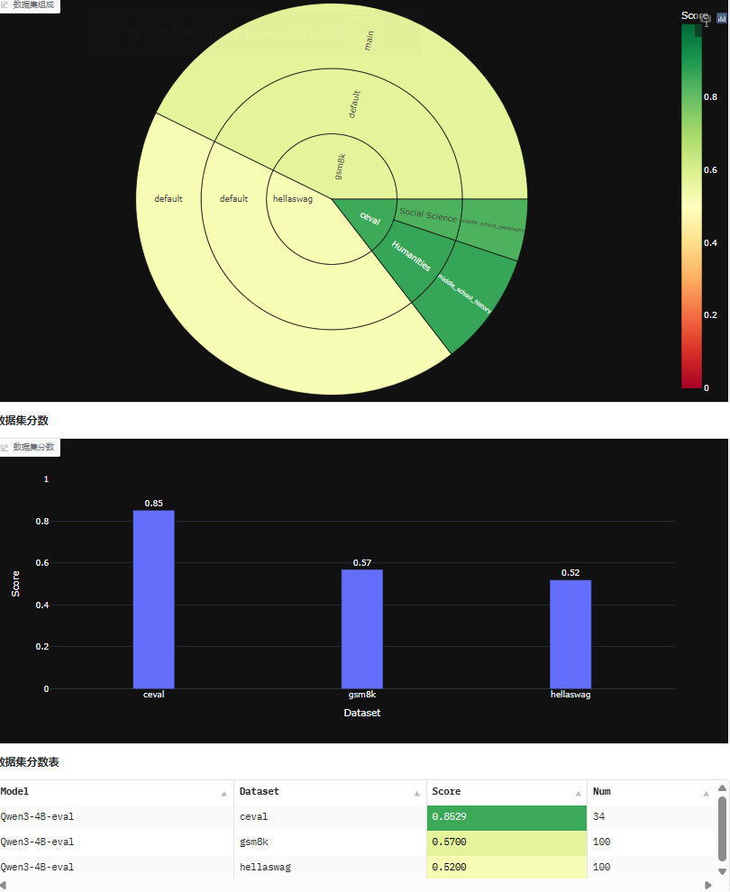

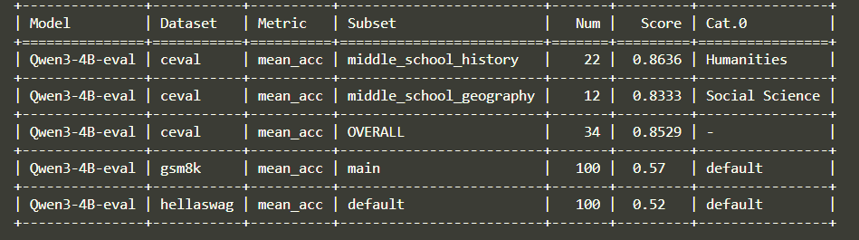

#### **对于`Qwen3-4B-Thinking-2507`**

较全面评估: `evalscope/evalscope_qwen3_4b-thinking-2507.py`（没跑完，Thinking模型太慢了，只跑完了mmlu_pro(每类100条)）

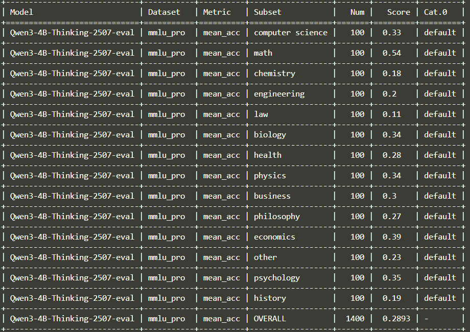


#### ⭐ 对于`Qwen3-4B-Instruct-2507`

Instruct模型推理输出比Thinking模型快


🌟 **微调`gsm8k_zh`**后进行`evalscope`评估：

⬆️ 微调前（原模型）：
`/home/crq/llm_scripts/evalscope/evalscope_qwen3_4b-instruct-2507.py`(断点续传)

换模型测评：修改里面的`model='Qwen3-4B-Instruct-2507-eval'`；

断点续测：修改`use_cache`参数，注释掉就不断点续测了。

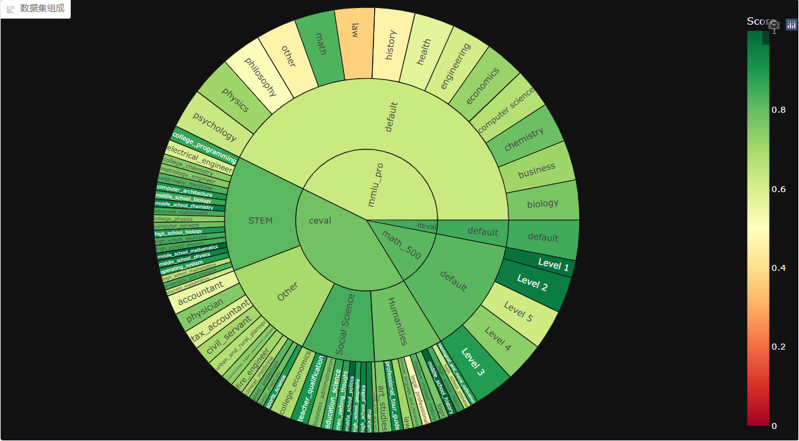
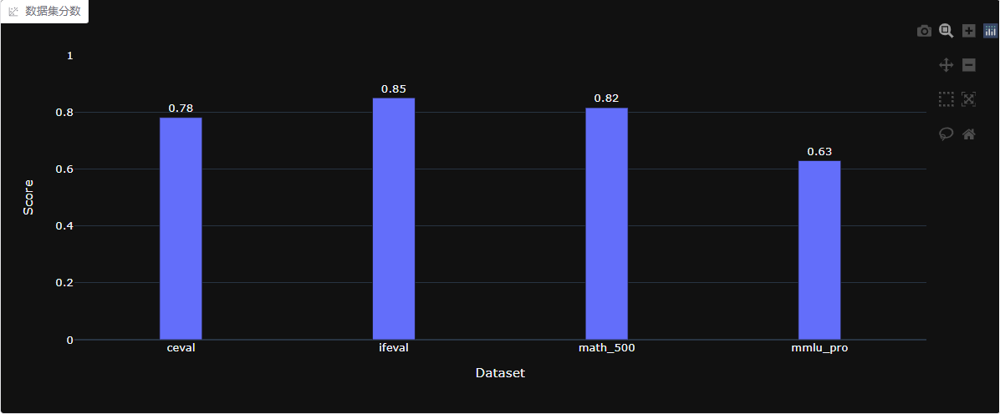
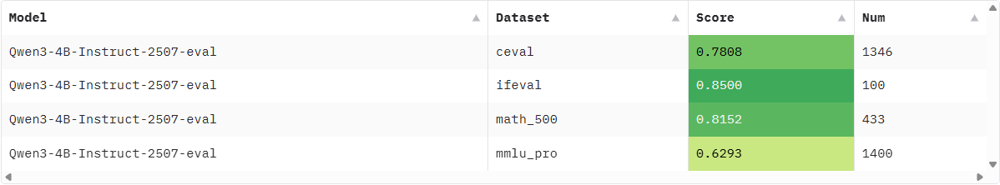

⬇️ 微调后：

（`LLaMA-Factory/saves/Qwen3-4B-Instruct-2507/lora/sft_gsm8k_zh/checkpoint-500`, 大概是8epoch）：

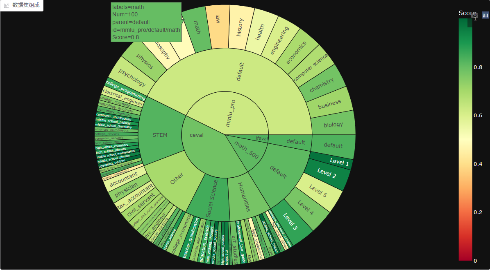
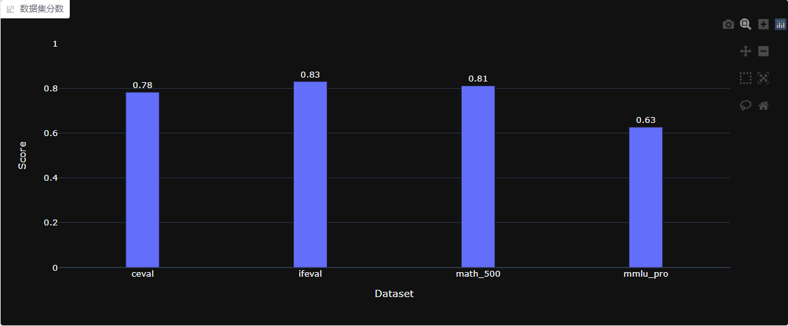
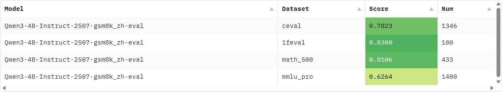

# 多模态模型 

## Qwen3-VL-4B-Instruct

微调豆类叶片病变分类数据集tany0699/beans3，用train部分微调训练，用val部分评估。

**不使用evalscope**

评估脚本是`evalscope/evaluate_qwen3_vl_4b_instruct.py`, 先后启动原模型和微调后的模型的vllm，只需修改评估脚本的`MODEL_NAME`，然后运行评估脚本即可。

| 原模型 | LoRA微调后 |
| :---: | :---: |
|  | 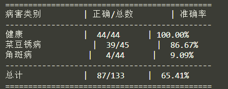 |

微调训练了5epoch, 30分钟，考虑到时间较短、lora提升能力难以突破不了解的事物、4B模型较小等限制，没训练出来。

只做熟悉工具用，不求实现效果提升。

| 病1 | 病2 |
| :---: | :---: |
|  |  |
|  |  | 