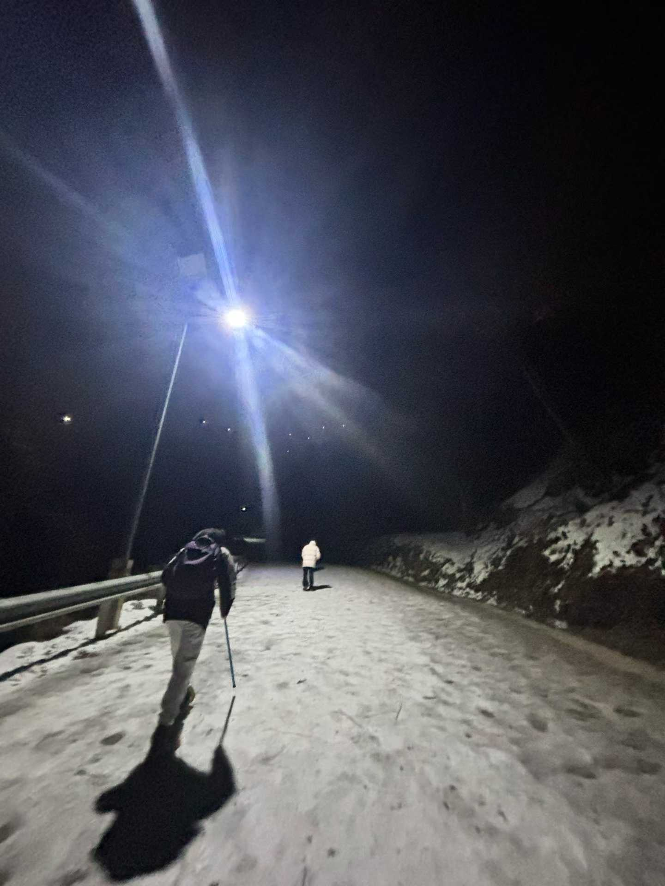

### 使用modelscope推理Qwen3-4B-Thinking-2507:

`inference/infer_Qwen3-4B-Thinking-2507_using_modelscope.py`

## 启动vllm后：使用OpenAI格式API（Qwen3-4B-Thinking-2507-eval）

### 单次推理

```bash
curl http://127.0.0.1:8010/v1/chat/completions \
  -H "Content-Type: application/json" \
  -d '{
    "model": "Qwen3-4B-Instruct-2507-eval",
    "messages": [
      {"role": "user", "content": "请解释量子计算的基本原理"}
    ],
    "max_tokens": 8192,
    "temperature": 0.7
  }'
```


### 流式输出

```bash
curl http://127.0.0.1:8000/v1/chat/completions \
  -H "Content-Type: application/json" \
  -d '{
    "model": "Qwen3-4B-Thinking-2507-eval",
    "messages": [
      {"role": "user", "content": "写一首关于春天的诗"}
    ],
    "max_tokens": 500,
    "stream": true
  }'
```


## Qwen3-VL-4B-Instruct

### 推理图片

```bash
# 1. 设置路径变量
IMG_PATH="4b4808c0ba43bd611e9ce54c712f0ff0.jpg"
JSON_FILE="request.json"

# 2. 将图片转为 Base64 并构造完整的 JSON 文件
echo "正在对图片进行编码..."
BASE64_IMG=$(base64 -w 0 "$IMG_PATH")

echo "正在生成 JSON 请求文件..."
cat <<EOF > $JSON_FILE
{
  "model": "Qwen3-VL-4B-Instruct",
  "messages": [
    {
      "role": "user",
      "content": [
        {"type": "text", "text": "请描述这张图片。"},
        {
          "type": "image_url",
          "image_url": {
            "url": "data:image/jpeg;base64,$BASE64_IMG"
          }
        }
      ]
    }
  ],
  "max_tokens": 512
}
EOF

# 3. 使用 curl 的 -d @ 选项从文件中读取数据
echo "正在发送请求到 vLLM..."
curl http://127.0.0.1:8010/v1/chat/completions \
  -H "Content-Type: application/json" \
  -d @$JSON_FILE

# 4. (可选) 清理临时文件
# rm $JSON_FILE
```




### 推理视频

由于视频文件通常较大，强烈建议使用 Python 而不是 curl。
`infer_vedio_Qwen3-VL-4B-Instruct.py`

<video src="IMAGES/67b1e1726f1836bde701039704b80c.mp4" controls title="Title"></video>


### [github主页](https://github.com/QwenLM/Qwen3-VL)有更详细的推理教程，包括使用`from openai import OpenAI`, vllm/SGLang进行本地推理。还有docker部署等。