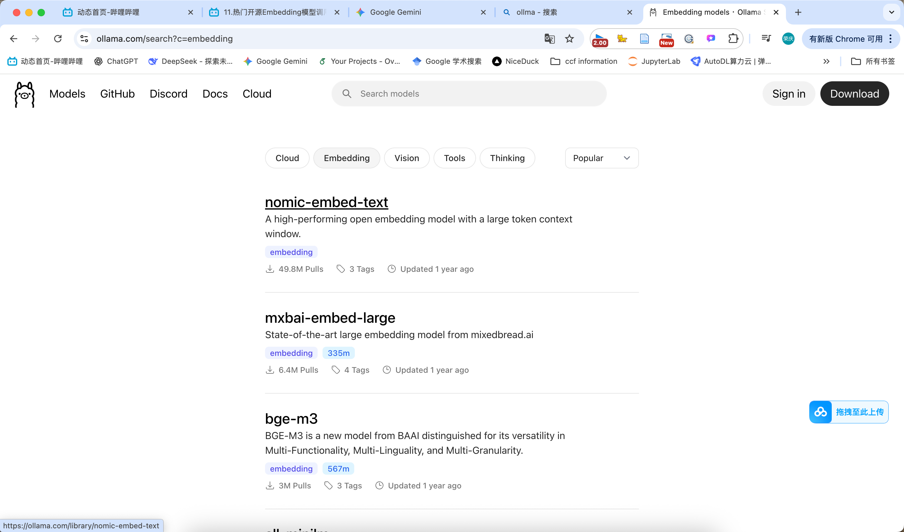

# RAG 流程: Source ➡️ Load ➡️ Transform ➡️ Embed ➡️ Store ➡️ Retrieve

有时候还涉及重排序

### 1. Source 

### 2. Load：

[LangChain Document Loaders](https://python.langchain.com/docs/integrations/document_loaders/)

### 3. Transform / Split

不同的文档切分策略

多模态的识别、切分 更复杂：OCR识别图中文字、CLIP、

### 4. Embedding模型

- 在线：openAI的embedding模型：准备openAI的API key、国内反向代理地址； DashScope平台（阿里云百炼）（有qwen3 embedding），准备API Key
- 本地部署开源embedding模型 Ollama官网可以搜索，ollama拉取、本地部署，例如BGE，然后可以`from langchain_ollama import OllamaEmbeddings`, 进行后续embedding。

### 5. Store:词向量数据库

chroma
FAISS

## 基于LangChain的RAG系统开发

- 护栏(Guardrails)机制
- pdf转换成markdown更有利于切分，RAG效果更好