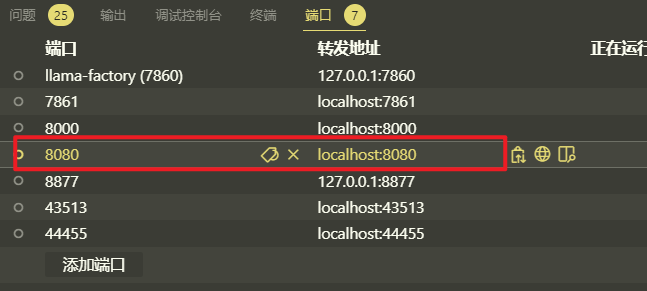
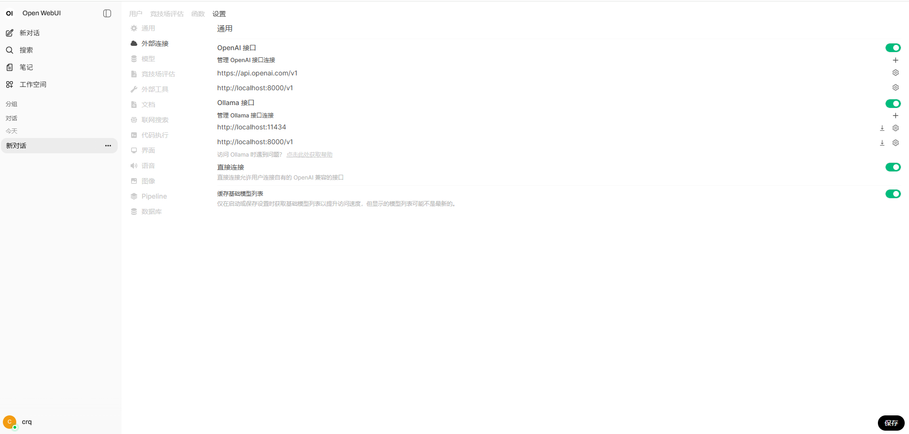

## 安装open-webui
```bash
conda activate openwebui
```

pypi：

```bash
pip install open-webui
```

或者使用docker。

## 启动：

```bash
open-webui serve
```

不需要 RAG 功能启动：（禁用相关初始化）:

```bash
export RAG_EMBEDDING_MODEL=""
open-webui serve --port 9999
```


## 进入界面

确认启动vllm
手动添加8080端口转发

确认端口的命令：
```bash
crq@ubun:~/llm_scripts$ ps aux | grep python | grep openwebui
crq       457962 41.1  2.1 14274612 1064804 pts/32 Sl+ 20:56   0:22 /home/crq/.conda/envs/openwebui/bin/python3.11 /home/crq/.conda/envs/openwebui/bin/open-webui serve

crq@ubun:~/llm_scripts$ lsof -p 457962 | grep LISTEN
open-webu 457962  crq   35u     IPv4          211853985        0t0       TCP *:http-alt (LISTEN)

crq@ubun:~/llm_scripts$ grep http-alt /etc/services
http-alt        8080/tcp        webcache        # WWW caching service

```





进入界面，点击左下角头像 -- 管理员面板 -- 设置 -- 外部连接 



设置好后即可通过openwebui使用vllm启动的`Qwen3-4B-Thinking-2507-eval`