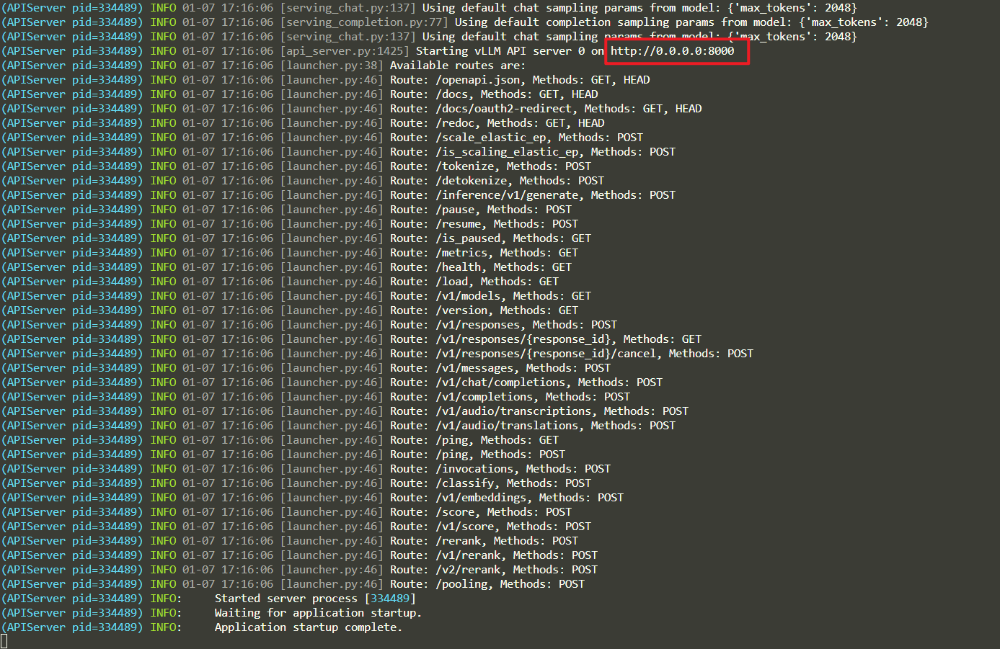
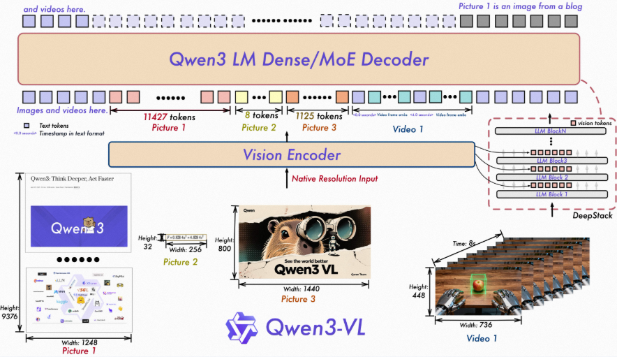

### 1. 启动vllm：qwen3-0.6b-base原始模型

```bash
CUDA_VISIBLE_DEVICES=3 python -m vllm.entrypoints.openai.api_server \
    --model /home/crq/.cache/modelscope/hub/models/Qwen/Qwen3-0.6B-Base \
    --host 0.0.0.0 \
    --port 8000 \
    --gpu-memory-utilization 0.7 \
    --served-model-name Qwen3-0.6B-Base-eval
```

直接进入`localhost:8000`是没有界面（404），仅开放端口供其他（例如`evalscope`）使用。

### 2. 启动vllm: qwen3-4b原始模型
```bash
CUDA_VISIBLE_DEVICES=3 python -m vllm.entrypoints.openai.api_server \
    --model /home/crq/.cache/modelscope/hub/models/Qwen/Qwen3-4B \
    --host 0.0.0.0 \
    --port 8000 \
    --served-model-name Qwen3-4B-eval \
    --max-model-len 8192 \
    --gpu-memory-utilization 0.9 \
    --max-num-seqs 16
```


### 3. 启动vllm: qwen3-4b-thinking-2507

```bash
CUDA_VISIBLE_DEVICES=3 python -m vllm.entrypoints.openai.api_server \
    --model /home/crq/.cache/modelscope/hub/models/Qwen/Qwen3-4B-Thinking-2507 \
    --host 0.0.0.0 \
    --port 8000 \
    --max-model-len 16384 \
    --served-model-name Qwen3-4B-Thinking-2507-eval \
    --gpu-memory-utilization 0.95 \
    --max-num-seqs 16 
```


### 4. 双卡启动vllm: qwen3-4b-instruct-2507

```bash
VLLM_USE_V1=0 CUDA_VISIBLE_DEVICES=0,3 python -m vllm.entrypoints.openai.api_server \
    --model /home/crq/.cache/modelscope/hub/models/Qwen/Qwen3-4B-Instruct-2507 \
    --host 0.0.0.0 \
    --port 8010 \
    --tensor-parallel-size 2 \
    --max-model-len 32768 \
    --served-model-name Qwen3-4B-Instruct-2507-eval \
    --gpu-memory-utilization 0.80 \
    --trust-remote-code
```

VLLM_USE_V1=0 的作用是强制 vLLM 使用旧版的“稳定引擎”（V0），而不是目前尚处于实验阶段的新版“V1 引擎”

### 5. 双卡启动vllm: qwen3-4b-instruct-2507 + gsm8k_zh lora微调

关键参数：  
- --enable-lora 
- --lora-modules
- 添加 `--enforce-eager` 来彻底禁用 CUDA Graph 捕获，这是解决 capture_model 阶段 OOM 的最有效手段。同时通过 max-loras 限制 LoRA 预留。  
- `--enforce-eager`: 最关键。它跳过了导致报错的 capture_model 步骤。虽然推理会慢 10-20%，但它不要求连续的大块显存来录制图。
- `-gpu-memory-utilization` 0.7: 强制只给 vLLM 分配 70% 的显存。对于 12G 的卡，这能留下 3.6G 给系统和 PyTorch 上下文使用。
- `--max-loras` 1: 默认 vLLM 会预留多个 LoRA 槽位，手动设为 1 可以节省大量显存。
- `--port` 指定端口

```bash
VLLM_USE_V1=0 CUDA_VISIBLE_DEVICES=0,3 python -m vllm.entrypoints.openai.api_server \
  --model /home/crq/.cache/modelscope/hub/models/Qwen/Qwen3-4B-Instruct-2507 \
  --host 0.0.0.0 --port 8010 \
  --enable-lora \
  --lora-modules gsm8k_lora=/home/crq/LLaMA-Factory/saves/Qwen3-4B-Instruct-2507/lora/sft/checkpoint-189 \
  --tensor-parallel-size 2 \
  --max-model-len 32768 \
  --gpu-memory-utilization 0.7 \
  --max-loras 1 \
  --enforce-eager \
  --served-model-name Qwen3-4B-Instruct-2507-gsm8k_zh-eval \
  --trust-remote-code
```

### 6.双卡启动vllm: Qwen3-VL-4B-Instruct


```bash
VLLM_USE_V1=0 CUDA_VISIBLE_DEVICES=0,3 python -m vllm.entrypoints.openai.api_server \
  --model /home/crq/.cache/modelscope/hub/models/Qwen/Qwen3-VL-4B-Instruct \
  --host 0.0.0.0 --port 8010 \
  --tensor-parallel-size 2 \
  --max-model-len 16384 \
  --gpu-memory-utilization 0.7 \
  --max-loras 1 \
  --enforce-eager \
  --served-model-name Qwen3-VL-4B-Instruct \
  --trust-remote-code
```

### 7.双卡启动vllm: Qwen3-VL-4B-Instruct + 微调豆类叶片病变分类微调

```bash
VLLM_USE_V1=0 CUDA_VISIBLE_DEVICES=0,3 python -m vllm.entrypoints.openai.api_server \
  --model /home/crq/.cache/modelscope/hub/models/Qwen/Qwen3-VL-4B-Instruct \
  --host 0.0.0.0 --port 8010 \
  --enable_lora \
  --lora-modules beans3=/home/crq/LLaMA-Factory/saves/Qwen3-VL-4B/lora/beans_sft/checkpoint-325 \
  --tensor-parallel-size 2 \
  --max-model-len 16384 \
  --gpu-memory-utilization 0.7 \
  --max-loras 1 \
  --enforce-eager \
  --served-model-name Qwen3-VL-4B-Instruct-lora-beans3 \
  --trust-remote-code
```

